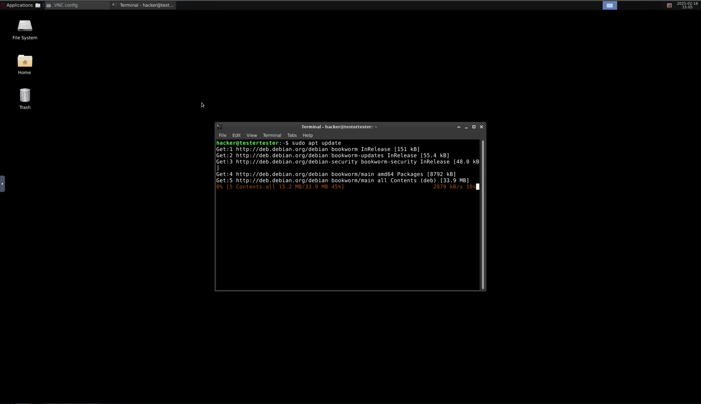
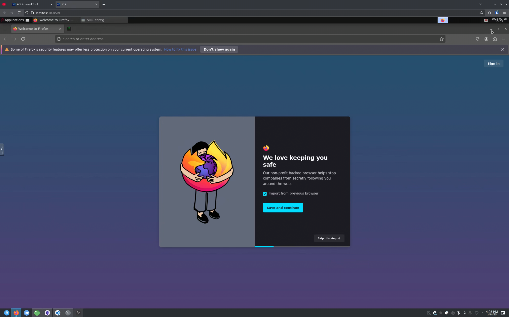
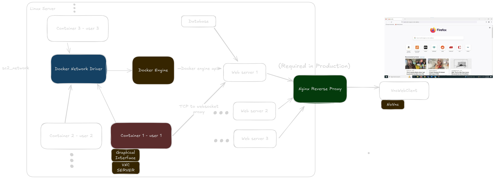

# SC2 Virtualized
SC2 virtualized is a web-based platform designed to provide users with on-demand Linux instances directly from their browser. Built on Docker containerization, SC2 virtualized enables students and professionals to experiment with Linux environments without requiring local virtualization. The platform also supports running essential tools like Wireshark, making it ideal for cybersecurity and networking education. By offering a self-hosted solution, SC2 virtualized aims to enhance interactive learning and simplify access to Linux-based training resources.




## Prerequisites

Ensure you have the following installed before proceeding:

- **Linux Host Server** or any **POSIX** compliant host OS or **WSL** if using windows (Required: Unix domain sockets are only supported on Linux to communicate with the docker engine)
- **Docker** (Must be installed and running)
- **Bun.sh** (Typescript runtime)

## Build & Run

First make a **.env** file following the .env.example file (rename the .env.example file)
To build and start the project, use the following commands:


```sh
bun run build
bun run start
```


## Folder structure
   
     .
     ├── container               # Container image files needed to build the docker container 
     ├── frontend                # Frontend files
     ├── server                  # Backend files
          ├── db                      # Database migrations
     ├── LICENSE  
     └── README.md 
   
## Architecture
